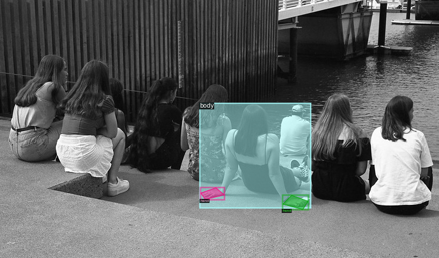

# Hand-Body Association Project
This repository contains the implementation of the research study "[Whose Hands are These? Hand Detection and Hand-Body Association in the Wild](https://www3.cs.stonybrook.edu/~sunarasimhas/webpage/BodyHands.pdf)". The objective of this project is to develop a solution for the problem of hand detection and hand-body association under unconstrained conditions.

# Project Content
This project employs the Detectron2 library and the Mask R-CNN model to simultaneously detect hands and bodies and correctly associate them. This association task can be complex due to the possible presence of multiple individuals, variable occlusions, and overlaps. This project also demonstrates the benefits of hand-body association in crucial applications like hand tracking and hand contact estimation.

# Dataset
The [BodyHands dataset](http://vision.cs.stonybrook.edu/~supreeth/BodyHands/BodyHands.zip) was used in this project. This dataset consists of unconstrained images where the locations of hands and corresponding bodies are annotated. You can download it from [here](http://vision.cs.stonybrook.edu/~supreeth/BodyHands/BodyHands.zip).

In the above you can see an annotated image taken from the BodyHands dataset. The image distinctly illustrates that only one human body has been labeled. The reason behind this is that, within the parameters of this dataset, a body is only labeled if it includes an associated hand class. Thus, even if multiple bodies are present in the image, those without associated hand classes remain unlabeled.



# Results
The model was evaluated against a dataset that consisted of 5983 instances of the hand class and 4341 instances of the body class. Upon evaluation, the model achieved an Average Precision (AP) score of 81.22 for the hand class.

# Installation and Setup
Before starting, make sure you have correctly installed all the necessary packages. They are listed in the `requirements.txt` file. You can install them using the following command:

```bash
pip install -r requirements.txt
```
# Contact
For any questions, comments, or feedback, please reach out to:

Melike Çolak - n22239753@cs.hacettepe.edu.tr
